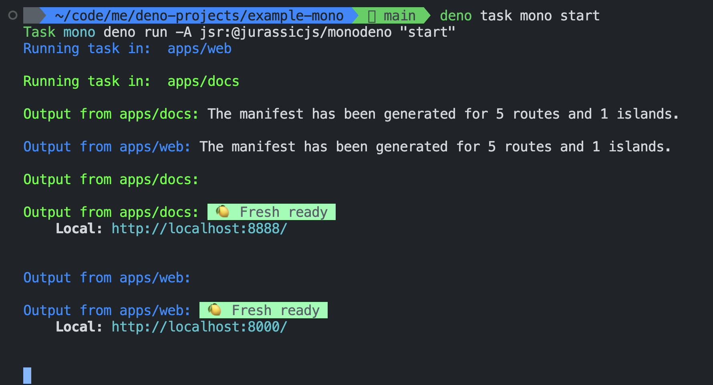

## Usage Example

```bash
deno task mono <command>
```

```bash
deno task mono start
```



# Monodeno 
A JurassicJS package for using deno commands in a monorepo with deno workspaces

## Description

Monodeno is a JurassicJS package that provides a simple way to run deno commands in a monorepo with deno workspaces. It is a wrapper around the deno command that allows you to run deno commands in a monorepo with deno workspaces.

## Functionality

deno monorepo <command>

## setup

### Install monodeno

```bash
deno add  jsr:@jurassicjs/monodeno
```

ensure you have workpaces in your deno project. For example, in your `deno.json` file, you should have something like this:
```json
{
  "tasks": {
    "mono": "deno run -A jsr:@jurassicjs/monodeno",
  },
  "workspaces": [
    "apps/web",
    "apps/docs",
  ]
}
```

This task will run the `start` command in all the workspaces in your monorepo.

## Demo Project
This project has monodeno as a dependency. You can clone the project and run the following command to see how it works.


https://github.com/jurassicjs/denomono


```bash
git clone https://github.com/jurassicjs/denomono.git
```
